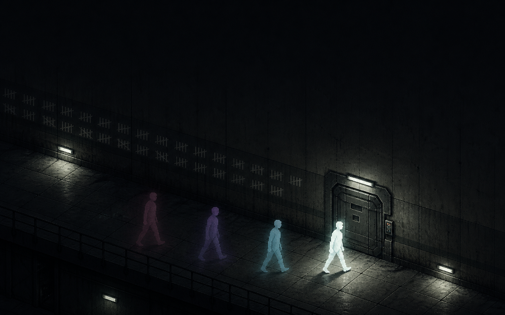

<p align="center">
  
</p>

<h1 align="center">I.MY.ME.MINE</h1>

<p align="center">
  <strong>실패할 때마다 과거의 내가 동료가 되는 60초 타임루프 스텔스 퍼즐</strong><br>
  <em>Fail now. Escape later.</em>
</p>

<p align="center">
  <a href="https://nuounce.github.io/imymemine/"><strong>▶ 설치 없이 바로 플레이</strong></a>
</p>

<p align="center">
  <code>TypeScript</code> · <code>Vite</code> · <code>Canvas 2D</code> · No Framework<br>
  정적 브라우저 빌드 · 런타임 네트워크 호출 0
</p>

---

문은 혼자 열리지 않는다. 하지만 이 시설에서 실패는 사라지지 않는다.

발판 위에서 현재 루프를 확정하면, 방금 전의 나는 **잔상**으로 남아 같은 행동을 되풀이한다. 과거의 내가 발판을 누르는 동안 지금의 나는 열린 문을 통과한다. 경비는 그 잔상을 보고, 듣고, 실제 존재처럼 추적한다.

남은 몸은 넷뿐이다.

> **I → MY → ME → MINE**  
> 제목이 곧 남은 자원이다.

## 한눈에 보기

| | |
|---|---|
| **60초** | 한 루프에 주어진 최대 시간 |
| **4개의 몸** | I, MY, ME, MINE으로 이어지는 제한된 자원 |
| **15개 스테이지** | 새로운 규칙이 한 단계씩 결합되는 4막 캠페인 |
| **4종의 경비** | 시야, 소리, 냄새, 알람에 서로 다르게 반응 |
| **3가지 플레이 모드** | STORY, GAUNTLET, TIME ATTACK |
| **411개 테스트** | 103개 스위트, 실패 0 |

## 핵심 메커니즘

### 잔상은 녹화 영상이 아니라 입력 테이프다

루프가 끝나면 세계는 틱 0으로 돌아간다. 잔상은 저장된 이동과 행동 입력을 처음부터 다시 실행한다. 정해진 궤적을 재생하는 것이 아니라 **과거의 내가 같은 세계를 다시 플레이한다.**

그래서 이전 루프의 선택은 현재 세계를 바꾼다.

- 잔상이 발판을 밟으면 문이 열린다.
- 잔상이 달리면 경비가 그 발소리를 조사한다.
- 잔상이 경비를 끌고 가면 다음 루프의 순찰 경로가 달라진다.
- LISTEN 모드에서는 과거의 기침과 주변 소음까지 같은 순간에 재현된다.

### 플레이 흐름

| 단계 | 행동 | 결과 |
|---:|---|---|
| **1. 기록** | 이동하고 장치를 조작한다 | 현재 행동이 입력 테이프에 쌓인다 |
| **2. 확정** | 원하는 순간 `R`을 누른다 | 지금까지의 나를 잔상으로 남긴다 |
| **3. 재생** | 다음 루프를 시작한다 | 잔상이 같은 행동을 다시 수행한다 |
| **4. 탈출** | 잔상과 역할을 나눈다 | 혼자 열 수 없던 길을 통과한다 |

> `R`이 이 게임의 주무기다. 60초는 상한일 뿐이다. 5초 만에 발판 위에서 루프를 확정하면, 그 잔상은 남은 시간 동안 계속 발판을 눌러 준다.

## 3분 안에 핵심 보기

1. **스테이지 1 — 자리**  
   발판을 밟으면 문이 열리고, 내려오면 닫힌다. 발판 위에서 `R`을 눌러 첫 잔상을 남긴다.

2. **스테이지 5 — 유인**  
   잔상이 `Shift`로 달려 소음을 내면 경비가 그쪽으로 움직인다. 현재의 나는 비워진 길을 통과한다.

3. **스테이지 6 — 선택**  
   시끄러운 지름길과 조용한 우회로 중 하나를 고른다. 두 경로 모두 정답이지만 필요한 테이프가 다르다.

막히면 시간을 흘려보내도 된다. 다섯 번 실패하면 `T`로 결정적 힌트 한 줄을 확인할 수 있고, 열 번 실패하면 `N`으로 해당 스테이지를 건너뛸 수 있다. 두 기능은 STORY 모드에서만 제공되며 기록 모드의 성적에는 영향을 주지 않는다.

## 조작

| 키 | 동작 |
|---|---|
| `WASD` / 방향키 | 이동 |
| `Shift` | 달리기 — 빠르지만 소음이 커진다 |
| `E` | 버튼·레버·순차 장치 상호작용 |
| `R` | 현재 루프 조기 확정 및 잔상 생성 |
| `F` | 섬광탄 사용 |
| `Q` → `1` / `2` / `3` | 잔상 하나를 지우고 다시 녹화 — 스테이지당 1회 |
| `Backspace` 2초 | 스테이지 전체 초기화 — `DEBT +1` |
| `T` / `N` | 힌트 / 스테이지 건너뛰기 |
| `Esc` / `M` | 일시정지 / 음소거 |
| `−` / `=` | LISTEN 모드 마이크 감도 조절 |

모바일에서는 화면 탭과 가상 스틱으로 같은 동작을 수행한다.

## 캠페인

15개 스테이지는 4막으로 이어진다. 새로운 장치를 한꺼번에 쏟아내지 않고, 막마다 잔상의 역할을 다시 정의한다.

| 막 | 스테이지 | 주요 장치 | 잔상의 역할 |
|---|---:|---|---|
| **1막 · 수용 (I)** | 1–4 | 발판, 게이트, 상자 | 자리 → 순간 → 대체물 → 순서 |
| **2막 · 감시 (MY)** | 5–8 | 경비, CCTV, 레버, 소음 바닥 | 소리와 동선으로 경비를 유인하는 자원 |
| **3막 · 통제 (ME)** | 9–12 | 순차 버튼, 주기 레이저, 섬광탄 | 정해진 순간에 여러 역할을 수행하는 시각표 |
| **4막 · 경계 (MINE)** | 13–15 | 전력 채널 | 하나를 켜기 위해 다른 하나를 포기하는 자원 배분 |

경비는 스테이지 5부터 등장한다. 1막에서는 잔상의 문법을 먼저 익히고, 이후부터 감시와 추적이 결합된다.

### 경비 4종

| 유형 | 위협 | 대응 |
|---|---|---|
| **SENTRY** | 넓게 고개를 돌리며 순찰한다 | 시야가 비는 순간을 고른다 |
| **HOUND** | 냄새를 추적하며 오래 쫓는다 | 다른 방향에 소음을 만들어 먼저 보낸다 |
| **BRUTE** | 크고 느리지만 통로를 압박한다 | 들어오지 못하는 좁은 길을 이용한다 |
| **WATCHER** | 움직이지 않고 시설의 알람을 올린다 | 우회하거나 섬광탄으로 잠시 무력화한다 |

네 유형은 같은 상태기계로 작동하며, 행동 차이는 속도·감지 범위·충돌 크기 같은 수치에서 나온다. BRUTE가 좁은 통로에 들어오지 못하는 상황도 별도 예외가 아니라 실제 충돌 판정의 결과다.

## 플레이 모드

### 진행 방식

| 모드 | 구성 |
|---|---|
| **STORY** | 스테이지 단위 진행, 막간 만화와 단계별 지원 기능 제공 |
| **GAUNTLET** | 15개 스테이지 연속 진행, 누적된 `DEBT` 유지 |
| **TIME ATTACK** | 전체 스테이지의 합산 기록 경쟁 |

### 감지 방식

| 모드 | 구성 |
|---|---|
| **EASY** | 키보드·터치 입력만 사용 |
| **LISTEN** | 실제 마이크 음량이 게임 속 소음으로 반영됨 |

LISTEN 모드는 음성을 저장하거나 전송하지 않는다. 원본 마이크 신호를 0~3단계의 음량 값으로 바꿔 입력 테이프의 빈 비트에 기록한다.

## 기술

### 결정론적 시뮬레이션

잔상 재생이 한 틱이라도 어긋나면 퍼즐이 성립하지 않는다. 그래서 시뮬레이션에는 난수와 실제 시계가 없고, 위치와 속도는 정수 서브픽셀로 계산한다.

```text
1 px   = 256 서브픽셀
1 타일 = 8,192 서브픽셀
걷기   = 512 서브픽셀/틱
한 타일 이동 = 정확히 16틱
```

- `src/sim/` — DOM과 분리된 순수 정수 시뮬레이션
- `src/render/` — `SimState`를 읽어 화면만 그리는 렌더 계층
- `src/game/` — 루프, 잔상 확정, DEBT, 런 기록 관리
- `src/engine/` — 고정 틱 루프, 입력, 오디오, 마이크, 터치

레이저와 CCTV도 주기와 위상으로만 움직인다. 같은 입력은 브라우저와 실행 시점이 달라도 같은 결과와 같은 상태 해시를 만든다.

### Codex와 함께 만든 검증 루프

Codex는 저장소를 분석하고 코드를 작성하는 역할에 더해, 게임을 플레이하고 심사 기준에 따라 약점을 찾은 뒤 변경 결과를 다시 검증하는 과정에 사용됐다.

```text
PLAY → EVALUATE → BUILD → VERIFY → REPEAT
```

1. 브라우저에서 실제 플레이 경로를 재현한다.
2. 플레이 가능성, 난도, 피드백, 발표 리스크를 평가한다.
3. 가장 영향이 큰 문제부터 수정한다.
4. 같은 입력 테이프와 자동 테스트로 회귀 여부를 확인한다.
5. 블라인드 플레이 결과를 다음 개선 루프에 반영한다.

게임 규칙과 서사, 아트 방향, 우선순위는 팀이 결정한다. Codex의 제안은 실제 플레이 결과와 테스트로 검증한 뒤 채택한다.

평가 기록은 [`judging/`](./judging/)에서 확인할 수 있다.

## 그래픽과 사운드

AI로 제작하고 사람이 검수한 픽셀 아트 스프라이트 위에 조명, 시야, 파티클, 후처리를 코드로 실시간 합성한다. 효과음과 환경음은 오디오 파일 없이 WebAudio로 생성한다.

| 레이어 | 구성 |
|---|---|
| **스프라이트** | 인물 4방향 보행, 경비 4종, 장치·아이템 13종, 만화 배경 5장, 타이틀 키 비주얼 |
| **코드 렌더링** | 바닥·벽 변형, 형광등, 시야 원뿔, 접지 그림자, 소음 링, 비네트, 그레인 |
| **WebAudio** | 발소리, 경보, 장치음, 환경음 등 모든 효과음 |

- 원본 스프라이트는 32px 타일을 2배 크기인 64px 셀로 제작했다.
- 이미지는 로드 직후 절반 크기로 한 번 변환하고, 이후 1:1 정수 배율로 그린다.
- 잔상은 같은 플레이어 시트에 색상과 투명도를 코드로 적용한다.
- 불러오지 못한 스프라이트는 기존 코드 드로잉으로 대체한다.
- 외부 폰트와 오디오 파일은 사용하지 않는다.
- 플레이 중 외부 네트워크 호출이 발생하지 않는다.

## 테스트

**411개 테스트 · 103개 스위트 · 실패 0**

시각적 결과보다 먼저 게임 규칙을 증명한다.

| 테스트 | 검증 내용 |
|---|---|
| `solvability.test.ts` | 15개 스테이지가 정답 입력 테이프로 클리어 가능한지 확인 |
| `rules.test.ts` | 모든 스테이지가 잔상 없이 클리어될 수 없음을 확인 |
| `determinism.test.ts` | 같은 입력이 항상 같은 상태 해시를 만드는지 확인 |
| `qa.test.ts` | 스테이지별 타이밍 여유와 조작 허용 폭 측정 |
| `guards.test.ts` · `hound.test.ts` | 경비의 감지·추적·수색 규칙 검증 |
| `sprites.test.ts` | 에셋 경로, 시트 규격, 방향별 행, 프레임 범위 검증 |
| `whisper.test.ts` | 상황별 속말이 시뮬레이션에 영향을 주지 않는지 확인 |

이 밖에도 이동, 장치, 마이크, 터치, 게임 모드, 인트로, 엔딩과 브라우저 지원을 검증한다.

## 로컬 실행

### 요구 사항

- Node.js 20 이상

### 개발 서버

```bash
npm install
npm run dev
```

### 검증과 빌드

```bash
npm test
npm run build
```

빌드 결과물은 정적 파일로 생성된다. GitHub Actions는 다음 세 단계를 모두 통과한 결과만 배포한다.

```text
verify → build → deploy
```

- **verify** — 타입 체크와 전체 테스트
- **build** — 프로덕션 빌드와 개발용 훅 유출 검사
- **deploy** — GitHub Pages 배포

## 프로젝트 구조

```text
src/
├── main.ts          # 캔버스·입력·오디오·마이크·게임 페이즈
├── engine/          # 고정 틱 루프, 입력, WebAudio, 마이크, 터치
├── sim/             # 순수 정수 시뮬레이션
│   ├── world.ts     # createWorld / stepWorld
│   ├── physics.ts   # AABB 충돌, 상자 밀기, 정수 레이캐스트
│   ├── guard.ts     # 공통 경비 상태기계
│   └── devices.ts   # 발판, 버튼, 게이트, CCTV, 레이저, 전력 버스
├── game/
│   ├── session.ts   # 루프, 잔상, DEBT, 런 기록
│   ├── levels.ts    # 15개 스테이지 데이터
│   └── whisper.ts   # 상황별 속말과 단계 힌트
└── render/
    ├── renderer.ts  # 월드 렌더링과 ViewState
    ├── sprites.ts   # 에셋 로딩, 프레임 선택, 폴백
    ├── hud.ts       # HUD, 타이틀, 전환, 결과 화면
    └── intro.ts     # 3페이지 만화 인트로

tests/               # 자동 검증 스위트
judging/             # 심사 루브릭과 라운드별 평가 기록
```

## 문서

| 문서 | 내용 |
|---|---|
| [`SPEC.md`](./SPEC.md) | 결정론, 틱 파이프라인, 장치 동작을 포함한 상세 설계 |
| [`PLAYER-GUIDE.md`](./PLAYER-GUIDE.md) | 조작과 시스템을 설명하는 플레이어 가이드 |
| [`WALKTHROUGH.md`](./WALKTHROUGH.md) | 스테이지별 정답 테이프와 틱 단위 측정 결과 |
| [`QA_REPORT.md`](./QA_REPORT.md) | 기능 및 회귀 검증 결과 |
| [`BALANCE_REVIEW.md`](./BALANCE_REVIEW.md) | 난도 곡선과 스테이지별 개선 검토 |
| [`STORY.md`](./STORY.md) | 세계관과 전체 서사 |
| [`PRD.md`](./PRD.md) | 제품 목표와 게임 구조 |
| [`PITCH.md`](./PITCH.md) | 제출 및 발표용 핵심 메시지 |
| [`judging/`](./judging/) | 공식 기준 기반 심사 기록과 개선 루프 |
| [`AGENTS.md`](./AGENTS.md) | 팀과 AI 에이전트의 협업 규칙 |

---

<p align="center">
  <strong>I.MY.ME.MINE</strong><br>
  실패한 내가, 다음의 나를 살린다.<br><br>
  <sub>OpenAI Game Builders Seoul 출품작</sub>
</p>
